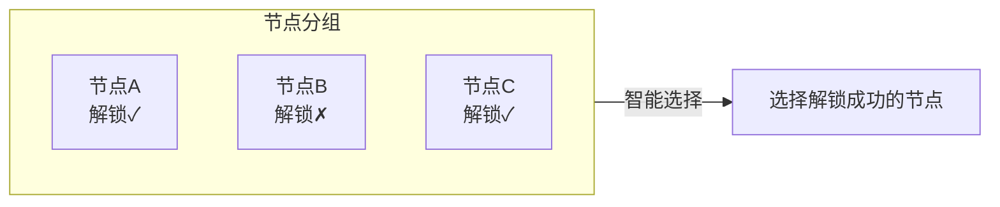
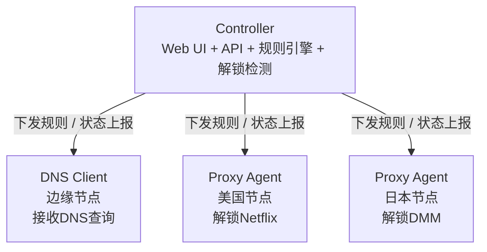

# chenfei Glass Prism DNS

这是 [xcxcadc/chenfei-Glass-Prism-dns](https://github.com/xcxcadc/chenfei-Glass-Prism-dns) 的中文增强版本。默认提供简体中文界面、自定义服务域名、服务级解锁机切换、IP 配置闭环、解锁链路流量统计、账户安全和客户端脚本。当前客户端工具版本为 `1.3.1`，完整说明见 [ENHANCED_ZH.md](ENHANCED_ZH.md)，增强层版本见 [Releases](https://github.com/xcxcadc/chenfei-Glass-Prism-dns/releases/latest)。

Prism-Gateway 是一个基于 DNS 的分流规则管理面板。轻量，非侵入式部署，支持流媒体解锁和 AI 服务智能解锁检测。采用 Liquid Glass 风格 UI。

[English](README_EN.md) | 中文

## 🌐 项目说明

上游在线演示 [prism.ciii.club](https://prism.ciii.club) 仅用于了解原始 Controller；本 Fork 的中文增强功能需按下方命令部署。

## 💬 加入讨论

**Telegram 群组**: [https://t.me/Prism_Gateway](https://t.me/Prism_Gateway)

## 功能特性

### 核心功能

- **智能 DNS 路由** - 根据域名规则将流量路由到不同 Proxy Agent
- **外部规则集支持** - 支持导入外部规则集文件，快速配置常用服务
- **流媒体解锁检测** - 自动检测 Netflix、Disney+、HBO Max 等 20+ 服务的解锁状态
- **AI 服务解锁检测** - 自动检测 OpenAI、Claude、Gemini、Copilot 等 AI 服务的可用状态
- **双栈 IPv4/IPv6** - 完整支持双协议
- **实时监控** - 基于 SSE 的节点状态实时更新
- **现代 UI** - Liquid Glass 设计风格，支持深色模式
- **简体中文增强界面** - 默认中文，可切换英文和深浅主题
- **细化服务域名库** - 动态解析 `stream.smartdns.list`，当前可拆分 170+ 服务条目
- **自定义服务** - 可在前端新增、编辑、删除任意服务名称与域名
- **服务级切换** - 每个 DNS 节点可将每项服务绑定到任意解锁机，并恢复 Smart/Fallback 自动选择
- **双层解锁检测** - 解锁机显示 Agent UnlockTests，目标 IP 再运行同源 UnlockTests，避免把“节点自检可用”误当成“客户端实际可用”
- **IP 配置闭环** - 添加目标 IP，批量选择服务及对应解锁机，自动创建 DNS 节点和服务覆盖
- **配置自动生效** - 已安装目标机保存增删服务后无需重复执行命令；通用 10 秒配置哈希守卫会安全重启 Agent 并清除旧 DNS 缓存
- **服务品牌图标** - 服务卡片和 IP 选择器加载对应站点图标，网络不可用时自动使用本地图标
- **客户端管理脚本** - 安装 DNS Agent、测试本机 DNS、接管/备份/恢复系统 DNS
- **流量统计** - 每个目标 IP 独立统计本机 Prism DNS 的 UDP/TCP 53，以及到所选解锁机的 TCP 80/443；不统计整机网卡流量
- **账户安全** - 点击右上角用户名，验证旧账号后修改管理员用户名和密码

### 路由模式

本项目支持灵活的节点分组和路由策略：

#### Group (节点分组)

将多个 Proxy Agent 组成一个分组，每个节点可设置优先级（数值越大优先级越高）。分组内支持两种选择策略：

| 组内策略 | 说明 |
|----------|------|
| **Smart** | 智能选择 - 在组内自动选择解锁状态最佳的节点 |
| **Fallback** | 故障转移 - 按组内优先级从高到低尝试，当前节点失败时自动切换到下一个 |

#### 优先级规则

优先级按数值从大到小排序：

```
优先级 100 (最高) → 优先级 50 → 优先级 10 → 优先级 1 (最低)
```

#### 工作原理

**Fallback 模式**：按优先级从高到低依次尝试


**Smart 模式**：自动选择解锁状态最佳的节点



**示例场景**：
- **Fallback 模式**：优先级 100 > 50 > 10，优先使用最高优先级节点，故障时依次降级
- **Smart 模式**：自动检测组内所有节点的解锁状态，选择解锁成功的节点

### 解锁检测

自动检测以下服务的解锁状态：

“节点管理”显示解锁机自身的 Agent UnlockTests；“IP 配置”会在目标服务器上运行与用户提供的 `dns_unlock.sh` 相同的 UnlockTests，并把原始结论回传到每个已选服务。服务配置页优先显示目标机实测结果，同时只对已知可访问的代表域名做 TLS 诊断，避免把仅用于路由的域名后缀根域误报为故障。目标机审计在路由变化后自动执行，并定期刷新。

**流媒体服务**
- Netflix, Disney+, HBO Max, Amazon Prime Video
- Hulu, Paramount+, Peacock, Discovery+
- YouTube Premium, Spotify, Apple TV+
- BBC iPlayer, ITV, Channel 4, Channel 5
- 以及更多...

**AI 服务**
- OpenAI (ChatGPT)
- Anthropic (Claude)
- Google (Gemini)
- GitHub Copilot
- 以及更多...

## 安装

### 一键安装 (推荐)

```bash
curl -fsSL https://raw.githubusercontent.com/xcxcadc/chenfei-Glass-Prism-dns/main/enhanced_install.sh | sudo bash
```

自定义端口：

```bash
curl -fsSL https://raw.githubusercontent.com/xcxcadc/chenfei-Glass-Prism-dns/main/enhanced_install.sh \
  | sudo PRISM_PORT=8080 PRISM_CORE_PORT=18080 bash
```

脚本会安装或升级上游 Controller 和本 Fork 的中文增强层，升级前自动备份 `data.db`。

安装完成后：
- Web 界面：`http://你的IP:端口`
- 用户名：`admin`
- 密码：安装完成时显示
- 自定义服务数据：`/var/lib/prism-enhancer/custom-services.json`

登录后可点击右上角用户名打开“账户安全”，验证当前用户名和密码后修改管理员账户。

### 手动安装

Controller/Agent 二进制由[上游 Releases](https://github.com/mslxi/Liquid-Glass-Prism-dns/releases) 提供；中文增强层由[本 Fork Releases](https://github.com/xcxcadc/chenfei-Glass-Prism-dns/releases) 提供。通常建议直接使用上面的一键安装命令。

```bash
# 下载
wget https://github.com/mslxi/Liquid-Glass-Prism-dns/releases/latest/download/prism-controller-linux-amd64
chmod +x prism-controller-linux-amd64
mkdir -p /opt/prism
mv prism-controller-linux-amd64 /opt/prism/prism-controller

# 创建环境文件
echo "JWT_SECRET=$(openssl rand -hex 16)" > /opt/prism/.env

# 运行
cd /opt/prism && ./prism-controller --host 0.0.0.0 --port 8080
```

## Agent 安装

在节点服务器上安装 Agent：

```bash
curl -sL https://raw.githubusercontent.com/xcxcadc/chenfei-Glass-Prism-dns/main/agent_install.sh | bash -s -- --master <Controller地址> --secret <节点密钥>
```

### IP 客户端一键工具

先在 Web 界面的“IP 配置”中添加目标 IP、选择服务与解锁机并保存。页面会生成包含面板地址和配置令牌的专属命令。也可以先启动通用交互工具：

```bash
wget -qO- https://raw.githubusercontent.com/xcxcadc/chenfei-Glass-Prism-dns/main/prismdns.sh | sudo bash
```

页面生成的专属命令只用于目标机首次安装；后续在面板保存新增、取消或切换服务会自动生效，不再弹出安装命令。通用工具支持安装/连接 DNS Client Agent、本机 DNS 测试、永久或临时设置系统 DNS、自动备份、恢复及状态检查。安装器会备份并停用占用 53/80/443 的旧 `dnsmasq`/`sniproxy`，但不会修改 XrayR 或 V2bX。每台新目标机默认安装通用配置哈希守卫，每 10 秒读取该机器自己的面板地址和令牌；路由变化时仅安全重启 `prism-agent`，等待 53 端口恢复后再提交新哈希，避免上游热更新残留旧 DNS 缓存。安装完成后还会创建专用 nftables 计数器；systemd timer 在启用后 15 秒内首次上报，之后每分钟按目标 IP 统计本机 Prism DNS 的 UDP/TCP 53 与所选解锁机 TCP 80/443。UnlockTests 审计产生的探测流量会在上报后从计数器中清除。

以上守卫、流量统计和自动应用逻辑均从每台目标机自己的配置动态生成，不包含固定 IP，可直接用于后续新增的任意解锁机和被解锁机。

IP 配置、节点密钥、专属令牌和流量基线保存在 `/var/lib/prism-enhancer/ip-configs.json`（`0600`）。不要公开页面生成的专属命令或令牌。完整操作步骤和统计口径见 [中文增强说明](ENHANCED_ZH.md)。

### Agent 参数说明

| 参数 | 说明 | 适用节点 |
|------|------|----------|
| `--master` | Controller 的地址，例如 `http://192.168.1.1:8080` | 所有节点 |
| `--secret` | 在 Controller 中创建节点时生成的密钥 | 所有节点 |
| `--smart` | 启用智能解锁检测模式 | 仅 DNS Client |
| `--beta` | 使用 Beta 版本 | 所有节点 |

## 架构



| 组件 | 描述 |
|------|------|
| **Controller** | 中央控制器，提供 Web UI、API、规则引擎和解锁检测 |
| **DNS Client** | 边缘节点，接收 DNS 查询，根据规则转发到对应 Proxy Agent |
| **Proxy Agent** | 出口节点，转发流量到目标服务器，上报解锁状态。支持嵌套解锁：若 VPS 商家提供 DNS 解锁服务，该 VPS 可作为 Proxy Agent 为其他 DNS Client 提供代理 |

## 使用流程

1. **安装 Controller** - 在中央服务器上安装
2. **创建节点** - 在 Web UI 中创建 DNS Client 和 Proxy Agent 节点
3. **安装 Agent** - 在各节点服务器上安装 Agent
4. **配置规则** - 创建 DNS 规则，选择路由模式和目标节点
5. **开始使用** - 将客户端 DNS 指向 DNS Client 节点

## 服务管理

```bash
# 查看状态
sudo systemctl status prism-controller

# 重启服务
sudo systemctl restart prism-controller

# 查看日志
journalctl -u prism-controller -f
```

## 📸 截图预览


