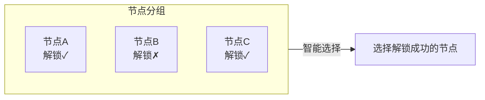
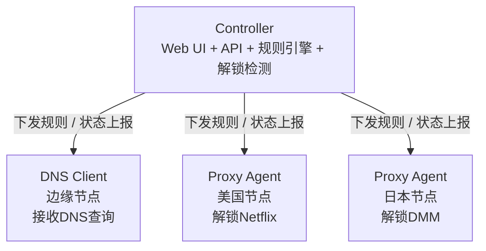

# chenfei Glass Prism DNS

这是 [xcxcadc/chenfei-Glass-Prism-dns](https://github.com/xcxcadc/chenfei-Glass-Prism-dns) 的中文增强版本。默认提供简体中文界面、自定义服务域名与分类、服务级解锁机切换、IP 配置闭环、解锁链路流量统计、账户安全和客户端脚本。当前面板增强层版本为 `1.5.10`，客户端工具版本为 `1.5.10`，加密传输版本为 `2.3.0`；完整说明见 [ENHANCED_ZH.md](ENHANCED_ZH.md)，增强层版本见 [Releases](https://github.com/xcxcadc/chenfei-Glass-Prism-dns/releases/tag/enhancer-v1.5.10)。

Prism-Gateway 是一个基于 DNS 的分流规则管理面板。轻量，非侵入式部署，支持流媒体解锁和 AI 服务智能解锁检测。采用 Liquid Glass 风格 UI。

[English](README_EN.md) | 中文

## 🌐 项目说明

上游在线演示 [prism.ciii.club](https://prism.ciii.club) 仅用于了解原始 Controller；本 Fork 的中文增强功能需按下方命令部署。

## 💬 加入讨论

**Telegram 群组**: [https://t.me/Prism_Gateway](https://t.me/Prism_Gateway)

## 功能特性

### 核心功能

- **智能 DNS 路由** - 根据域名规则将流量路由到不同 Proxy Agent
- **外部规则集支持** - 支持导入外部规则集文件，快速配置常用服务
- **流媒体解锁检测** - 自动检测 Netflix、Disney+、HBO Max 等 20+ 服务的解锁状态
- **AI 服务解锁检测** - 自动检测 OpenAI、Claude、Gemini、Copilot 等 AI 服务的可用状态
- **双栈节点管理** - 面板仍可管理 IPv4/IPv6 节点；受管 DNS 解锁链路固定使用 Proxy IPv4，并抑制已选服务的 AAAA，避免误走不解锁的 IPv6
- **实时监控** - 基于 SSE 的节点状态实时更新
- **现代控制台** - 表格化服务编排与概览卡片，提供服务编排、节点管理、IP 配置、域名同步、日志审计、告警和设置七个真实功能页，支持桌面/移动端、深浅主题和中英文切换
- **简体中文增强界面** - 默认中文，可切换英文和深浅主题
- **细化服务域名库** - 运行时动态解析 `stream.smartdns.list` 的最新有效服务；已停止运营的 Crackle、Salto、GYAO 不再参与路由
- **服务域名与删除管理** - 任意内置或自定义服务都可在前端编辑域名、增删域名并恢复域名库默认值；服务操作栏和配置弹窗提供彻底删除，删除会移除规则、目标 IP 路由、实测结果，并持久化隐藏内置服务，后续同步不会自动恢复
- **统一服务搜索** - 服务库和 IP 服务选择器均支持名称、中文别名、分类、服务 ID 与域名的精确或模糊搜索，忽略大小写及常见分隔符
- **分类自由编排** - 可新建自定义分类，把内置或自定义服务移动到任意分类并随时恢复原分类；分类调整不改变服务 ID、域名或已下发路由
- **服务级手动路由** - 每个受管目标 IP 的每项服务显式绑定到任意解锁机；只有保存配置才会改变出口，受管路由不跟随 Smart/Fallback 或检测结果自动跳转
- **稳定 Agent 数据面** - 安装器默认使用并锁定上游 `v1.2.1` 兼容 Agent，避免 `v1.3` 被动熔断在 WAF、拒绝连接或批量实测时把固定解锁 VIP 回退为公网 DNS
- **共享域名联动** - 使用相同父域、子域或泛域名的服务自动绑定同一解锁机；最后一次选择优先，避免一条 DNS 规则被两个出口互相覆盖
- **实测不改路由** - 目标机审计只更新结果，绝不会依据 WAF、超时或第三方检测波动自动切换解锁机；节点选择始终以用户最后一次保存为准
- **5 秒授权白名单** - Proxy 每 5 秒从面板同步已纳管目标 IPv4，只允许白名单访问 IPv4 DNS 53 与 SNI 80/443，并拒绝 IPv6 访问这些 Prism 端口；其他 IPv6 端口不受影响，同机 MTProxy 可继续使用
- **双层解锁检测** - 解锁机自检仍只作参考；目标 IP 审计在 IPv4 路由上执行 `media.ispvps.com` 的完整媒体检测，并叠加 DNS/TLS/SNI 路径校验
- **真实兼容性优先** - 每项已选服务依次验证精确 A 映射、AAAA 抑制、TLS/SNI 握手和代表页面/服务方项目；服务方明确返回 `NO`、`Banned`、WAF 或稳定性不足时直接显示不可用
- **IP 配置闭环** - 添加目标 IP，批量选择服务及对应解锁机，自动创建 DNS 节点和服务覆盖
- **配置自动生效** - 增强层持久化逐节点路由并由专用 dnsmasq 应用；10 秒守卫检查配置哈希、DNS 监听和代理进程 DNS 接管，保存后安全刷新本地 IPv4 路由，300 秒抽测每项服务代表域名
- **代理 DNS 统一接管** - 对 XrayR、V2bX、sing-box、Hysteria、TUIC 等活动 systemd 代理进程建立独立 DNS cgroup 规则，将请求交给本机 Prism Agent；XrayR 启用自定义 DNS 时会先备份并切换为读取系统 DNS，不修改 Docker、MTProxy 或 V2bX 配置
- **受限网络传输** - 目标机可通过加密 TCP SNI 传输连接解锁机；客户端每 60 秒同步并用真实 HTTPS 路径检查隧道，SSH 自身仍以 15 秒保活、3 次失联判定，发现“TCP 假在线”时只重建该隧道
- **四阶段全域名实测** - 每项服务逐一核对全部路由域名和应用依赖，结果给出 `DNS x/x`、`TLS/SNI y/y`、页面成功数和服务方结论；TLS 连续三次至少两次成功才通过
- **共存守护** - 仅监控并恢复 Prism 自有服务；XrayR 仅在从自定义 DNS 切换到系统 DNS 时重启一次，同机 MTProxy、V2bX、Docker 不受影响
- **服务品牌图标** - 服务卡片和 IP 选择器立即显示本地占位并异步替换为对应品牌图标；图标 URL 带版本指纹，发布后不会继续命中旧缓存，服务与图标映射持久化后可直接复用
- **客户端管理脚本** - 安装 DNS Agent、测试本机 DNS、接管/备份/恢复系统 DNS
- **流量统计** - 每个目标 IP 独立统计本机 Prism DNS 的 UDP/TCP 53，以及到所选解锁机的 TCP 80/443；不统计整机网卡流量

- **XrayR 系统 DNS** - 系统 DNS 模式下，XrayR 的自定义 DNS 会先备份 `/etc/XrayR/config.yml` 并切换为读取 `/etc/resolv.conf`，随后只重启一次 XrayR；V2bX、MTProxy、Docker 和其他业务配置不改动
- **账户安全** - 点击右上角用户名，验证旧账号后修改管理员用户名和密码

### 路由模式

本项目支持灵活的节点分组和路由策略：

#### Group (节点分组)

将多个 Proxy Agent 组成一个分组，每个节点可设置优先级（数值越大优先级越高）。分组内支持两种选择策略：

| 组内策略 | 说明 |
|----------|------|
| **Smart** | 智能选择 - 在组内自动选择解锁状态最佳的节点 |
| **Fallback** | 故障转移 - 按组内优先级从高到低尝试，当前节点失败时自动切换到下一个 |

#### 优先级规则

优先级按数值从大到小排序：

```
优先级 100 (最高) → 优先级 50 → 优先级 10 → 优先级 1 (最低)
```

#### 工作原理

**Fallback 模式**：按优先级从高到低依次尝试


**Smart 模式**：自动选择解锁状态最佳的节点



**示例场景**：
- **Fallback 模式**：优先级 100 > 50 > 10，优先使用最高优先级节点，故障时依次降级
- **Smart 模式**：自动检测组内所有节点的解锁状态，选择解锁成功的节点

### 解锁检测

自动检测以下服务的解锁状态：

“节点管理”显示解锁机自身的 Agent 自检，但只作参考；“IP 配置”会在目标服务器上下载并执行 `media.ispvps.com` 检测脚本的 IPv4 模式，再核对全部路由域名、AAAA 抑制、TLS/SNI 和代表页面，把脚本原始结论回传到每个已选服务。脚本没有对应项目的服务会明确显示“未覆盖”，不会伪造为可用。目标机审计在路由变化后自动执行并定期刷新，但只报告结果，不修改用户选择的解锁机。

**流媒体服务**
- Netflix, Disney+, HBO Max, Amazon Prime Video
- Hulu, Paramount+, Peacock, Discovery+
- YouTube Premium, Spotify, Apple TV+
- BBC iPlayer, ITV, Channel 4, Channel 5
- 以及更多...

**AI 服务**
- OpenAI (ChatGPT)
- Anthropic (Claude)
- Google (Gemini)
- GitHub Copilot
- 以及更多...

## 安装

### 一键安装 (推荐)

```bash
curl -fsSL https://raw.githubusercontent.com/xcxcadc/chenfei-Glass-Prism-dns/main/enhanced_install.sh | sudo bash
```

自定义端口：

```bash
curl -fsSL https://raw.githubusercontent.com/xcxcadc/chenfei-Glass-Prism-dns/main/enhanced_install.sh \
  | sudo PRISM_PORT=8080 PRISM_CORE_PORT=18080 bash
```

脚本会安装或升级上游 Controller 和本 Fork 的中文增强层，升级前自动备份 `data.db`。

安装完成后：
- Web 界面：`http://你的IP:端口`
- 用户名：`admin`
- 密码：安装完成时显示
- Controller 数据：`/opt/prism/data.db`
- 中文增强层全部数据：`/var/lib/prism-enhancer/`

登录后可点击右上角用户名打开“账户安全”，验证当前用户名和密码后修改管理员账户。
侧栏的“站点设置”可以自定义左上角网页名称、说明文字和浏览器标签标题，设置保存在 `/var/lib/prism-enhancer/branding.json`。
服务库中的“分类管理”可新建分类；每项服务右侧的“分类”按钮可移动或恢复分类，设置保存在 `/var/lib/prism-enhancer/catalog-preferences.json`。

更换服务器前必须同时备份 Controller 数据库、环境文件和整个 Enhancer 数据目录。完整导出、恢复、验证及回滚步骤见 [面板迁移与灾备教程](MIGRATION_ZH.md)。

### 手动安装

Controller/Agent 二进制由[上游 Releases](https://github.com/mslxi/Liquid-Glass-Prism-dns/releases) 提供；中文增强层由[本 Fork Releases](https://github.com/xcxcadc/chenfei-Glass-Prism-dns/releases) 提供。通常建议直接使用上面的一键安装命令。

```bash
# 下载
wget https://github.com/mslxi/Liquid-Glass-Prism-dns/releases/latest/download/prism-controller-linux-amd64
chmod +x prism-controller-linux-amd64
mkdir -p /opt/prism
mv prism-controller-linux-amd64 /opt/prism/prism-controller

# 创建环境文件
echo "JWT_SECRET=$(openssl rand -hex 16)" > /opt/prism/.env

# 运行
cd /opt/prism && ./prism-controller --host 0.0.0.0 --port 8080
```

## Agent 安装

在节点服务器上安装 Agent：

```bash
curl -sL https://raw.githubusercontent.com/xcxcadc/chenfei-Glass-Prism-dns/main/agent_install.sh | bash -s -- --master <Controller地址> --secret <节点密钥>
```

### IP 客户端一键工具

先在 Web 界面的“IP 配置”中添加目标 IP、选择服务与解锁机并保存。页面会生成包含面板地址和配置令牌的专属命令。也可以先启动通用交互工具：

```bash
wget -qO- https://raw.githubusercontent.com/xcxcadc/chenfei-Glass-Prism-dns/main/prismdns.sh | sudo bash
```

页面生成的专属命令只用于目标机首次安装；后续在面板保存新增、取消或切换服务会自动生效，不再弹出安装命令。通用工具支持安装/连接 DNS Client Agent、本机 DNS 测试、永久或临时设置系统 DNS、自动备份、恢复及状态检查。安装器会备份并停用冲突的旧 `dnsmasq`/`sniproxy`，再安装仅监听 `127.0.0.1:5353` 的 Prism 专用 dnsmasq，不会修改 MTProxy、XrayR 或 V2bX。增强层根据面板配置动态生成精确 IPv4 与 AAAA 抑制规则，nftables 将本机 53 请求重定向到专用 dnsmasq；Agent 继续负责同步、授权和报告，但不再决定实际 DNS 路由。为避免上游 `v1.3` 被动熔断在 WAF、拒绝连接或并发实测时回退公网 DNS，稳定通道默认下载上游 `v1.2.1`、验证 SHA-256 并锁定二进制；重新执行安装或卸载时会自动解除锁定。每台新目标机默认安装配置哈希守卫：每 10 秒检查配置与 DNS 监听，每 300 秒抽测各服务代表域名；配置变化、30 分钟健康缓存刷新和服务审计仍会全量验证所有域名。路由变化时优先原子替换 dnsmasq 规则并重启专用本地 DNS，只有健康恢复失败才重启 Agent。受限网络目标机会使用加密 TCP SNI 传输代替不稳定的跨境 UDP 53，发往已选解锁机的 UDP/443 会被明确拒绝以促使应用回落到 TCP/TLS。每项已选服务依次执行 A 映射、AAAA 抑制、三次 TLS/SNI 握手和代表页面/服务方检测；明确的 `NO`、`Banned`、WAF 或稳定性不足会显示失败，但不会回滚系统 DNS 或自动改写用户节点。Proxy 每 5 秒刷新面板授权白名单，未纳管 IPv4 无法使用 DNS 53 或 SNI 80/443。安装完成后还会创建专用 nftables 单调计数器；面板按采样差值累计，每分钟任务只上报流量，耗时的四阶段检测由独立审计服务执行。审计结束后开启新计数纪元，检测流量不会计入用户用量；清零面板流量时保留采样基线，旧流量不会被重新加回。

以上守卫、IPv4 优先、AAAA 抑制、TLS/SNI 实测、授权白名单、流量统计和自动应用逻辑均从面板数据动态生成，不包含固定 IP，可直接用于后续新增的任意解锁机和被解锁机。实测结果不会触发节点跳转；如需更换线路，必须在面板手动选择并保存。

IP 配置、节点密钥、专属令牌和流量基线保存在 `/var/lib/prism-enhancer/ip-configs.json`（`0600`）。目标机另外将 DNS 与每个加密传输方向的 nftables 原始计数持久化到 `/var/lib/prismdns/traffic-cumulative.json`，单个计数器重建或审计清零不会让历史流量丢失；重新绑定新配置时按令牌隔离统计状态。不要公开页面生成的专属命令或令牌。完整操作步骤和统计口径见 [中文增强说明](ENHANCED_ZH.md)。

### Agent 参数说明

| 参数 | 说明 | 适用节点 |
|------|------|----------|
| `--master` | Controller 的地址，例如 `http://192.168.1.1:8080` | 所有节点 |
| `--secret` | 在 Controller 中创建节点时生成的密钥 | 所有节点 |
| `--smart` | 启用智能解锁检测模式 | 仅 DNS Client |
| `--beta` | 使用 Beta 版本 | 所有节点 |

## 架构



| 组件 | 描述 |
|------|------|
| **Controller** | 中央控制器，提供 Web UI、API、规则引擎和解锁检测 |
| **DNS Client** | 边缘节点，接收 DNS 查询，根据规则转发到对应 Proxy Agent |
| **Proxy Agent** | 出口节点，转发流量到目标服务器，上报解锁状态。支持嵌套解锁：若 VPS 商家提供 DNS 解锁服务，该 VPS 可作为 Proxy Agent 为其他 DNS Client 提供代理 |

## 使用流程

1. **安装 Controller** - 在中央服务器上安装
2. **创建节点** - 在 Web UI 中创建 DNS Client 和 Proxy Agent 节点
3. **安装 Agent** - 在各节点服务器上安装 Agent
4. **配置规则** - 创建 DNS 规则，选择路由模式和目标节点
5. **开始使用** - 将客户端 DNS 指向 DNS Client 节点

## 服务管理

```bash
# 查看状态
sudo systemctl status prism-controller

# 重启服务
sudo systemctl restart prism-controller

# 查看日志
journalctl -u prism-controller -f
```

## 迁移与备份

面板迁移不能只复制 `data.db`。节点中文名称与地区、自定义服务及分类、IP 路由、流量、品牌设置和加密传输信息保存在 `/var/lib/prism-enhancer/`。

请按 [面板迁移与灾备教程](MIGRATION_ZH.md) 操作，教程包含：

- 旧服务器停机一致性备份与 SHA256 校验
- 新服务器安装、恢复和权限修复
- 节点、服务、IP 配置、流量和品牌设置验证
- 域名或端口变化时的 Agent 重新接入
- 恢复失败后的回滚流程

## 📸 截图预览


