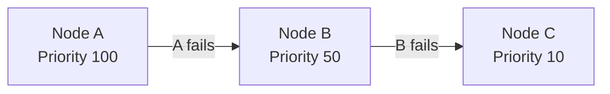
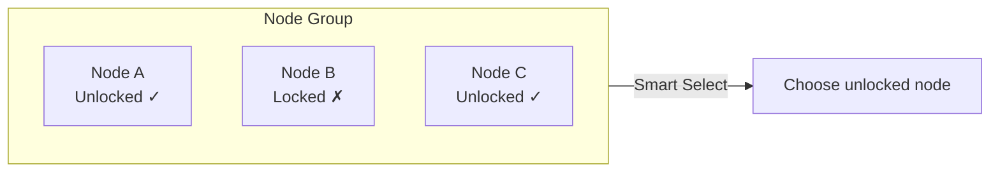
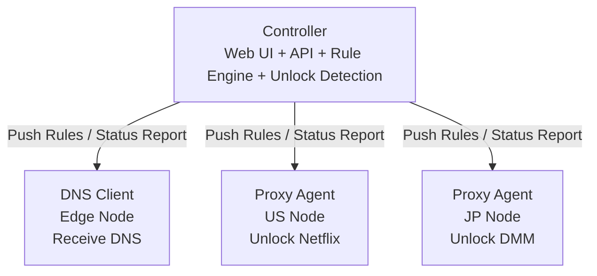

# chenfei Glass Prism DNS

This is the enhanced fork at [xcxcadc/chenfei-Glass-Prism-dns](https://github.com/xcxcadc/chenfei-Glass-Prism-dns). It adds a Simplified Chinese UI, custom service domains and categories, per-service proxy selection, IP configuration, unlock-link traffic accounting, account security, client tool `1.4.9`, and encrypted transport `2.2.2`. See [ENHANCED_ZH.md](ENHANCED_ZH.md) and the [latest release](https://github.com/xcxcadc/chenfei-Glass-Prism-dns/releases/latest).

Prism-Gateway is a lightweight, non-intrusive DNS-based traffic routing management panel. It supports streaming unlock and smart AI services unlock detection. Features a beautiful Liquid Glass-inspired UI.

[中文](README.md) | English

## 🌐 Project Notes

The upstream demo at [prism.ciii.club](https://prism.ciii.club) only demonstrates the original Controller. Deploy this fork to use the enhanced UI and routing features.

## 💬 Join the Community

**Telegram Group**: [https://t.me/Prism_Gateway](https://t.me/Prism_Gateway)

## Features

### Core Features

- **Smart DNS Routing** - Route traffic through different Proxy Agents based on domain rules
- **External Ruleset Support** - Import external ruleset files for quick configuration of common services
- **Streaming Unlock Detection** - Auto-detect unlock status for Netflix, Disney+, HBO Max, and 20+ services
- **AI Services Unlock Detection** - Auto-detect availability of OpenAI, Claude, Gemini, Copilot and other AI services
- **Dual-Stack Node Management** - The panel still manages IPv4/IPv6 nodes, while managed unlock routes always use proxy IPv4 and suppress AAAA for selected services
- **Real-time Monitoring** - SSE-based live node status updates
- **Modern Console** - Table-based orchestration and overview cards with seven functional pages for services, nodes, target IPs, catalog sync, audit logs, alerts, and settings; responsive desktop/mobile layouts with light/dark themes and Chinese/English
- **Chinese Enhanced UI** - Simplified Chinese by default, with English and theme switching
- **Detailed Service Catalog** - Dynamically parses the latest active services from `stream.smartdns.list`; discontinued Crackle, Salto, and GYAO entries are excluded
- **Custom Services** - Add, edit, and delete arbitrary service names and domain lists in the UI; both `example.com` and `*.example.com` are preserved and compiled into deduplicated `DOMAIN-SUFFIX` rules
- **Unified Service Search** - The service library and IP picker support exact and fuzzy matching across names, localized aliases, categories, service IDs, and domains while ignoring case and common separators
- **Flexible Categories** - Create custom categories, move any built-in or custom service between them, and restore the original category without changing service IDs, domains, or deployed routes
- **Explicit Per-Service Routing** - Bind every service on a managed target IP to a proxy explicitly; routes change only after a save and never follow Smart/Fallback or audit results automatically
- **Overlapping-Domain Linking** - Services sharing parent, child, or wildcard domains automatically use one proxy; the latest selection wins
- **Audits Never Change Routes** - Target audits update reports only; WAF responses, timeouts, and third-party detector instability never switch the proxy selected by the user
- **Five-Second Allowlist** - Proxies refresh managed target IPv4 addresses every five seconds, restrict IPv4 DNS 53 plus SNI 80/443, and reject IPv6 on those Prism ports; unrelated IPv6 ports remain untouched for co-hosted MTProxy
- **Two-Layer Unlock Audit** - Shows proxy-side Agent UnlockTests and reruns the same detector on each target IP, avoiding false confidence from proxy-only checks
- **Target Compatibility First** - Every selected service validates all routed domains, AAAA suppression, and browser dependencies; WAF-limited third-party probes are accepted only when the complete DNS and browser path passes
- **IP Configuration Workflow** - Add a target IP, choose services and proxy agents, then create DNS nodes and overrides automatically
- **Automatic Route Application** - The enhancer restores persistent per-node routes on every Agent sync; a generic 10-second guard also verifies real DNS routes and safely restarts a stalled or stale Agent with rate limiting
- **Restricted-Network Transport** - Targets use encrypted TCP SNI transport with a real HTTPS path probe every 30 seconds; a TCP-only false positive rebuilds that tunnel without changing the user's SG/VN service selection
- **Complete Domain Audits** - Target audits verify every routed domain and curated browser dependency, reporting explicit `DNS x/x` and `HTTPS y/y` totals
- **Coexistence Watchdog** - Monitors and recovers only `prism-agent`; co-located MTProxy, XrayR, and V2bX services are left untouched
- **Service Brand Icons** - Service cards and the IP picker show an immediate local placeholder, replace it with the matching brand icon, prioritize configured services during startup prewarming, and persist fetched icons across restarts
- **Client Management Script** - Installs the DNS Agent, tests local DNS, and takes over, backs up, or restores system DNS
- **Traffic Accounting** - Per target IP, counts local Prism DNS UDP/TCP 53 plus TCP 80/443 exchanged with selected proxy IPs; whole-interface traffic is excluded
- **Account Security** - Click the username in the top bar to change the administrator username and password after verifying the current credentials

### Routing Modes

This project supports flexible node grouping and routing strategies:

#### Group (Node Grouping)

Combine multiple Proxy Agents into a group, each node can have a priority (higher value = higher priority). Two selection strategies are supported within a group:

| Strategy | Description |
|----------|-------------|
| **Smart** | Intelligent Selection - Automatically choose the node with best unlock status within the group |
| **Fallback** | Failover - Try nodes from highest to lowest priority, switch to next when current fails |

#### Priority Rules

Priority is sorted by value from high to low:

```
Priority 100 (Highest) → Priority 50 → Priority 10 → Priority 1 (Lowest)
```

#### How It Works

**Fallback Mode**: Try nodes from highest to lowest priority



**Smart Mode**: Automatically select the node with best unlock status



**Example Scenarios**:
- **Fallback Mode**: Priority 100 > 50 > 10, prefer highest priority node, degrade sequentially on failure
- **Smart Mode**: Auto-detect unlock status of all nodes in group, select the one that is unlocked

### Unlock Detection

Automatically detect unlock status for the following services:

Node Management shows the proxy Agent's own UnlockTests output. IP Configs reruns the same detector used by the referenced `dns_unlock.sh` on the actual target server and stores the raw result per selected service. Service pages prefer this target-side verdict and run TLS against one known live representative hostname, instead of incorrectly treating routing-only suffix roots as failed websites. Target audits run after route changes and refresh periodically.

**Streaming Services**
- Netflix, Disney+, HBO Max, Amazon Prime Video
- Hulu, Paramount+, Peacock, Discovery+
- YouTube Premium, Spotify, Apple TV+
- BBC iPlayer, ITV, Channel 4, Channel 5
- And more...

**AI Services**
- OpenAI (ChatGPT)
- Anthropic (Claude)
- Google (Gemini)
- GitHub Copilot
- And more...

## Installation

### One-Click Install (Recommended)

```bash
curl -fsSL https://raw.githubusercontent.com/xcxcadc/chenfei-Glass-Prism-dns/main/enhanced_install.sh | sudo bash
```

Custom ports:

```bash
curl -fsSL https://raw.githubusercontent.com/xcxcadc/chenfei-Glass-Prism-dns/main/enhanced_install.sh \
  | sudo PRISM_PORT=8080 PRISM_CORE_PORT=18080 bash
```

The script installs or upgrades the upstream Controller and this fork's enhancer, backing up `data.db` before upgrades.

After installation:
- Web UI: `http://YOUR_IP:PORT`
- Username: `admin`
- Password: Displayed after installation
- Custom service data: `/var/lib/prism-enhancer/custom-services.json`

### Manual Installation

Controller and Agent binaries come from the [upstream releases](https://github.com/mslxi/Liquid-Glass-Prism-dns/releases). Enhancer binaries come from [this fork's releases](https://github.com/xcxcadc/chenfei-Glass-Prism-dns/releases). The one-click installer is recommended.

```bash
# Download
wget https://github.com/mslxi/Liquid-Glass-Prism-dns/releases/latest/download/prism-controller-linux-amd64
chmod +x prism-controller-linux-amd64
mkdir -p /opt/prism
mv prism-controller-linux-amd64 /opt/prism/prism-controller

# Create environment file
echo "JWT_SECRET=$(openssl rand -hex 16)" > /opt/prism/.env

# Run
cd /opt/prism && ./prism-controller --host 0.0.0.0 --port 8080
```

## Agent Installation

Install Agent on node servers:

```bash
curl -sL https://raw.githubusercontent.com/xcxcadc/chenfei-Glass-Prism-dns/main/agent_install.sh | bash -s -- --master <Controller_URL> --secret <Node_Secret>
```

### IP Client Tool

First add the target IP in the Web UI's IP Configs view, select services and proxy agents, and save. The UI generates a dedicated command containing the panel URL and enrollment token. The generic interactive tool is also available:

```bash
wget -qO- https://raw.githubusercontent.com/xcxcadc/chenfei-Glass-Prism-dns/main/prismdns.sh | sudo bash
```

The dedicated command is only needed for the target's first installation. Later service additions, removals, and proxy switches apply automatically when saved in the panel. The generic tool installs/connects the DNS Client Agent, tests local DNS, applies permanent or temporary system DNS, and supports backup, restore, and status checks. The installer backs up and disables conflicting legacy `dnsmasq`/`sniproxy` services, but does not modify MTProxy, XrayR, or V2bX. Every new target receives a generic 10-second configuration hash guard that reads that machine's own panel URL and token. When routes change, it restarts only `prism-agent`, waits for port 53 and every IPv4 route, and then commits the new hash so upstream hot-reload cannot leave stale DNS entries. Restricted-network targets use encrypted TCP SNI transport instead of unreliable cross-border UDP 53. Service audits verify every routed domain and browser dependency, and a long-running audit cannot be queued repeatedly by the 10-second guard. Proxies refresh the panel allowlist every five seconds; unmanaged IPv4 addresses cannot use DNS 53 or SNI 80/443. Initial installation requires every selected domain to resolve to a configured proxy IPv4 while selected-service AAAA remains suppressed. Third-party HTTPS probe failures remain warnings, so regional policy, rate limiting, or transient TLS failures cannot block system DNS activation. Dedicated nftables counters record full RX/TX for local Prism DNS UDP/TCP 53 plus TCP 80/443 exchanged with selected proxy IPv4 addresses. The first report runs within 15 seconds and repeats every minute; automated UnlockTests traffic is removed from the counters before and after each audit.

IPv4 preference, AAAA suppression, overlapping-domain linking, read-only audits, five-second authorization, route guarding, traffic accounting, and automatic apply are generated from panel data with no fixed host addresses, so future proxy and target machines inherit the same behavior by default. Audit results never trigger route switching; changing an exit always requires an explicit save in the panel.

IP configurations, node secrets, enrollment tokens, and traffic baselines are stored in `/var/lib/prism-enhancer/ip-configs.json` with mode `0600`. Do not publish a dedicated command or enrollment token.

### Agent Parameters

| Parameter | Description | Applicable Nodes |
|-----------|-------------|------------------|
| `--master` | Controller URL, e.g., `http://192.168.1.1:8080` | All nodes |
| `--secret` | Node secret generated when creating node in Controller | All nodes |
| `--smart` | Enable smart unlock detection mode | DNS Client only |
| `--beta` | Use beta version | All nodes |

## Architecture



| Component | Description |
|-----------|-------------|
| **Controller** | Central controller with Web UI, API, rule engine and unlock detection |
| **DNS Client** | Edge node that receives DNS queries, forwards to corresponding Proxy Agent based on rules |
| **Proxy Agent** | Exit node that forwards traffic to target servers, reports unlock status. Supports nested unlocking: if a VPS provider offers DNS unlock service, that VPS can serve as a Proxy Agent to provide proxy for other DNS Clients |

## Workflow

1. **Install Controller** - Install on central server
2. **Create Nodes** - Create DNS Client and Proxy Agent nodes in Web UI
3. **Install Agents** - Install Agent on each node server
4. **Configure Rules** - Create DNS rules, select routing mode and target nodes
5. **Start Using** - Point client DNS to DNS Client node

## Service Management

```bash
# Check status
sudo systemctl status prism-controller

# Restart service
sudo systemctl restart prism-controller

# View logs
journalctl -u prism-controller -f
```

## 📸 Screenshots


