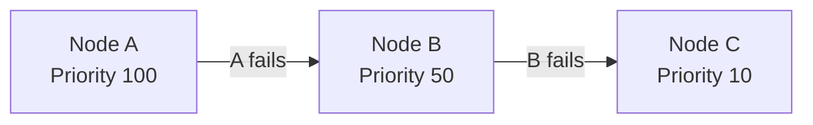
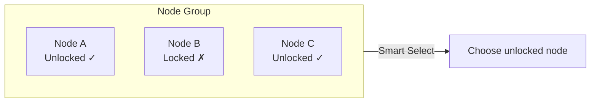
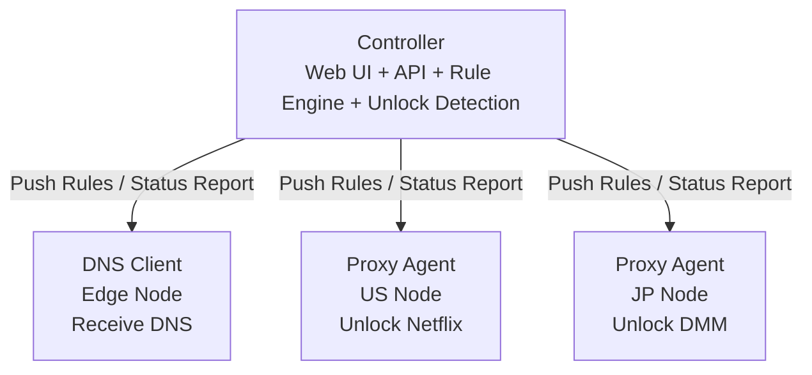

# chenfei Glass Prism DNS

This is the enhanced fork at [xcxcadc/chenfei-Glass-Prism-dns](https://github.com/xcxcadc/chenfei-Glass-Prism-dns). It adds a Simplified Chinese UI, custom service domains and categories, per-service proxy selection, IP configuration, unlock-link traffic accounting, account security, panel enhancer `1.5.20`, client tool `1.5.15`, and encrypted transport `2.3.1`. See [ENHANCED_ZH.md](ENHANCED_ZH.md) and the [latest release](https://github.com/xcxcadc/chenfei-Glass-Prism-dns/releases).

Prism-Gateway is a lightweight, non-intrusive DNS-based traffic routing management panel. It supports streaming unlock and smart AI services unlock detection. Features a beautiful Liquid Glass-inspired UI.

[中文](README.md) | English

## 🌐 Project Notes

The upstream demo at [prism.ciii.club](https://prism.ciii.club) only demonstrates the original Controller. Deploy this fork to use the enhanced UI and routing features.

## 💬 Join the Community

**Telegram Group**: [https://t.me/Prism_Gateway](https://t.me/Prism_Gateway)

## Features

### Core Features

- **Smart DNS Routing** - Route traffic through different Proxy Agents based on domain rules
- **External Ruleset Support** - Import external ruleset files for quick configuration of common services
- **Streaming Unlock Detection** - Auto-detect unlock status for Netflix, Disney+, HBO Max, and 20+ services
- **AI Services Unlock Detection** - Auto-detect availability of OpenAI, Claude, Gemini, Copilot and other AI services
- **Dual-Stack Node Management** - The panel still manages IPv4/IPv6 nodes, while managed unlock routes always use proxy IPv4, never auto-switch egress to IPv6, and suppress AAAA for selected services
- **Real-time Monitoring** - SSE-based live node status updates
- **Modern Console** - Table-based orchestration and overview cards with seven functional pages for services, nodes, target IPs, catalog sync, audit logs, alerts, and settings; responsive desktop/mobile layouts with light/dark themes and Chinese/English
- **Chinese Enhanced UI** - Simplified Chinese by default, with English and theme switching
- **Detailed Service Catalog** - Dynamically parses the latest active services from `stream.smartdns.list`; discontinued Crackle, Salto, and GYAO entries are excluded
- **Service Domains and Deletion** - Edit domains for any built-in or custom service, add or remove entries, restore catalog defaults, and permanently delete services from the table or configuration dialog. Deletion removes rules, target-IP routes, audit results, and persistently hides built-in services from future catalog syncs
- **Typed Split Rules** - The service editor supports domain suffixes, domain keywords, and IPv4/IPv6 `IP-CIDR` networks. Rule lists and Agent sync preserve `DOMAIN-SUFFIX`, `DOMAIN-KEYWORD`, and `IP-CIDR` types; built-in Grok includes the xAI/Twitter domains, the `twitter` keyword, and the six upstream CIDR ranges
- **Unified Service Search** - The service library and IP picker support exact and fuzzy matching across names, localized aliases, categories, service IDs, and domains while ignoring case and common separators
- **Flexible Categories** - Create custom categories, move any built-in or custom service between them, and restore the original category without changing service IDs, domains, or deployed routes
- **Explicit Per-Service Routing** - Bind every service on a managed target IP to a proxy explicitly; routes change only after a save and never follow Smart/Fallback or audit results automatically
- **Stable Agent Data Plane** - The installer pins upstream Agent `v1.2.1`, preventing the `v1.3` passive circuit breaker from replacing a fixed unlock VIP with public DNS after WAF responses, refused connections, or batch audits
- **Overlapping-Domain Linking** - Services sharing parent, child, or wildcard domains automatically use one proxy; the latest selection wins
- **Audits Never Change Routes** - Target audits update reports only; WAF responses, timeouts, and third-party detector instability never switch the proxy selected by the user
- **Five-Second Allowlist** - Proxies refresh managed target IPv4 addresses every five seconds, restrict IPv4 DNS 53 plus SNI 80/443, reject IPv6 DNS 53 only, and do not intercept IPv6 80/443 so co-hosted MTProxy or other IPv6 services keep working
- **Two-Layer Unlock Audit** - Proxy-side Agent checks remain reference-only; each target runs the IPv4 `check.unlock.media` media script plus DNS/TLS/SNI path checks
- **Target Compatibility First** - Every selected service validates exact A mapping, AAAA suppression, TLS/SNI handshakes, and a representative page/provider check; explicit `NO`, `Banned`, WAF, or unstable provider results fail clearly
- **IP Configuration Workflow** - Add a target IP, choose services and proxy agents, then create DNS nodes and overrides automatically
- **Automatic Route Application** - The enhancer persists per-node routes and generates dedicated dnsmasq rules; a 10-second guard atomically applies saved changes and checks the DNS listener, while a 300-second sample checks one representative domain per selected service
- **Restricted-Network Transport** - Targets synchronize and probe encrypted TCP SNI transport every 60 seconds; SSH still uses 15-second keepalives with three missed checks before failure, and a false-positive TCP path only rebuilds that tunnel
- **Four-Stage Domain Audits** - Target audits report `DNS x/x`, `TLS/SNI y/y`, page successes, and provider conclusions; at least two of three TLS handshakes must succeed
- **Coexistence Watchdog** - Monitors and recovers only `prism-agent`; co-located MTProxy, XrayR, and V2bX services are left untouched
- **Service Brand Icons** - Service cards and the IP picker show an immediate local placeholder, replace it with the matching brand icon, and use versioned asset URLs so corrected icons appear immediately instead of reusing stale browser cache
- **Client Management Script** - Installs the DNS Agent, tests local DNS, and takes over, backs up, or restores system DNS
- **Traffic Accounting** - Per target IP, counts local Prism DNS UDP/TCP 53 plus TCP 80/443 exchanged with selected proxy IPs; whole-interface traffic is excluded

- **XrayR System DNS** - In system-DNS mode, if XrayR has custom DNS enabled, the installer backs up `/etc/XrayR/config.yml`, switches XrayR to `/etc/resolv.conf`, and restarts XrayR once; V2bX, MTProxy, Docker, and other service configurations are untouched
- **Account Security** - Click the username in the top bar to change the administrator username and password after verifying the current credentials

### Routing Modes

This project supports flexible node grouping and routing strategies:

#### Group (Node Grouping)

Combine multiple Proxy Agents into a group, each node can have a priority (higher value = higher priority). Two selection strategies are supported within a group:

| Strategy | Description |
|----------|-------------|
| **Smart** | Intelligent Selection - Automatically choose the node with best unlock status within the group |
| **Fallback** | Failover - Try nodes from highest to lowest priority, switch to next when current fails |

#### Priority Rules

Priority is sorted by value from high to low:

```
Priority 100 (Highest) → Priority 50 → Priority 10 → Priority 1 (Lowest)
```

#### How It Works

**Fallback Mode**: Try nodes from highest to lowest priority



**Smart Mode**: Automatically select the node with best unlock status



**Example Scenarios**:
- **Fallback Mode**: Priority 100 > 50 > 10, prefer highest priority node, degrade sequentially on failure
- **Smart Mode**: Auto-detect unlock status of all nodes in group, select the one that is unlocked

### Unlock Detection

Automatically detect unlock status for the following services:

Node Management keeps proxy Agent self-checks as reference only. IP Configs runs the IPv4 command `bash <(curl -L -s check.unlock.media) -M 4` on the actual target server and stores the raw result per selected service, alongside full DNS/TLS/SNI path checks. Services missing from the script are reported as not covered rather than passed. Target audits run after route changes and refresh periodically without changing the selected proxy.

**Streaming Services**
- Netflix, Disney+, HBO Max, Amazon Prime Video
- Hulu, Paramount+, Peacock, Discovery+
- YouTube Premium, Spotify, Apple TV+
- BBC iPlayer, ITV, Channel 4, Channel 5
- And more...

**AI Services**
- OpenAI (ChatGPT)
- Anthropic (Claude)
- Google (Gemini)
- GitHub Copilot
- And more...

## Installation

### One-Click Install (Recommended)

```bash
curl -fsSL https://raw.githubusercontent.com/xcxcadc/chenfei-Glass-Prism-dns/main/enhanced_install.sh | sudo bash
```

Custom ports:

```bash
curl -fsSL https://raw.githubusercontent.com/xcxcadc/chenfei-Glass-Prism-dns/main/enhanced_install.sh \
  | sudo PRISM_PORT=8080 PRISM_CORE_PORT=18080 bash
```

The script installs or upgrades the upstream Controller and this fork's enhancer, backing up `data.db` before upgrades.

After installation:
- Web UI: `http://YOUR_IP:PORT`
- Username: `admin`
- Password: Displayed after installation
- Custom service data: `/var/lib/prism-enhancer/custom-services.json`

### Fresh Installation and Data Sanitization

The repository contains only program code, installer scripts, and frontend assets. It does not contain runtime databases, node secrets, credentials, IP routes, traffic records, or data from the current server. A new-server install creates empty stores and generates a new JWT secret and initial password; it never copies this panel's nodes or service configuration. After login, the icon can be replaced with a transparent PNG from `Settings -> Site settings`; the runtime file is stored at `/var/lib/prism-enhancer/branding-icon.png`.

To explicitly perform a sanitized fresh install on a host that previously ran Prism, first confirm that its old panel data is no longer needed, then run:

```bash
curl -fsSL https://raw.githubusercontent.com/xcxcadc/chenfei-Glass-Prism-dns/main/enhanced_install.sh \\
  | sudo env PRISM_FRESH_INSTALL=1 PRISM_CONFIRM_FRESH=YES bash
```

This mode removes only Prism's `/opt/prism/data.db`, `/opt/prism/.env`, initial-password file, and `/var/lib/prism-enhancer/`. It does not remove or modify Docker, XrayR, V2bX, MTProxy, or other services. Restoring an existing panel is always explicit through [MIGRATION_ZH.md](MIGRATION_ZH.md); the installer never imports old data automatically.

### Manual Installation

Controller and Agent binaries come from the [upstream releases](https://github.com/mslxi/Liquid-Glass-Prism-dns/releases). Enhancer binaries come from [this fork's releases](https://github.com/xcxcadc/chenfei-Glass-Prism-dns/releases). The one-click installer is recommended.

```bash
# Download
wget https://github.com/mslxi/Liquid-Glass-Prism-dns/releases/latest/download/prism-controller-linux-amd64
chmod +x prism-controller-linux-amd64
mkdir -p /opt/prism
mv prism-controller-linux-amd64 /opt/prism/prism-controller

# Create environment file
echo "JWT_SECRET=$(openssl rand -hex 16)" > /opt/prism/.env

# Run
cd /opt/prism && ./prism-controller --host 0.0.0.0 --port 8080
```

## Agent Installation

Install Agent on node servers:

```bash
curl -sL https://raw.githubusercontent.com/xcxcadc/chenfei-Glass-Prism-dns/main/agent_install.sh | bash -s -- --master <Controller_URL> --secret <Node_Secret>
```

### IP Client Tool

First add the target IP in the Web UI's IP Configs view, select services and proxy agents, and save. The UI generates a dedicated command containing the panel URL and enrollment token. The generic interactive tool is also available:

```bash
wget -qO- https://raw.githubusercontent.com/xcxcadc/chenfei-Glass-Prism-dns/main/prismdns.sh | sudo bash
```

The dedicated command is only needed for a target's first installation. Later additions, removals, and proxy changes apply automatically after a panel save. The installer backs up conflicting legacy `dnsmasq`/`sniproxy` services, then installs a Prism-specific dnsmasq listening only on `127.0.0.1:5353`; it never modifies MTProxy, XrayR, or V2bX. The enhancer dynamically renders exact IPv4 and AAAA-suppression rules from panel data, and nftables redirects local port 53 to this dedicated resolver. Agent remains responsible for synchronization, authorization, and reports, but no longer controls the effective DNS route. Stable installs download upstream Agent `v1.2.1`, verify its SHA-256, and lock the executable so the `v1.3` passive circuit breaker cannot silently restore public DNS after WAF responses, refused connections, or batch audits; reinstall and uninstall operations unlock it automatically. Every target receives a generic guard that checks configuration and the DNS listener every 10 seconds and samples one representative domain per service every 300 seconds. Configuration changes, the 30-minute health-cache refresh, and service audits still verify every routed domain. Route changes atomically replace dnsmasq rules and restart the dedicated local resolver first; Agent is restarted only as a recovery fallback. Restricted-network targets use encrypted TCP SNI transport, while UDP/443 to selected unlock peers is rejected so QUIC-capable applications fall back to TCP/TLS. Every selected service passes through exact A mapping, AAAA suppression, three TLS/SNI handshakes, and representative page/provider validation. Explicit `NO`, `Banned`, WAF, or unstable provider results are reported as failures, but never rewrite the user's route or roll back system DNS. Proxies refresh the allowlist every five seconds. The minute timer reports monotonic dedicated nftables counters, and the panel accumulates sample deltas. The dedicated audit service runs expensive four-stage checks and starts a new counter epoch afterward so audit traffic is excluded. Clearing panel traffic preserves the current sample baseline, preventing historical bytes from being added again.

IPv4 preference, AAAA suppression, overlapping-domain linking, TLS/SNI audits, five-second authorization, route guarding, traffic accounting, and automatic apply are generated from panel data with no fixed host addresses, so future proxy and target machines inherit the same behavior by default. Audit results never trigger route switching; changing an exit always requires an explicit save in the panel.

IP configurations, node secrets, enrollment tokens, and traffic baselines are stored in `/var/lib/prism-enhancer/ip-configs.json` with mode `0600`. Each target also persists DNS RX/TX and transport RX/TX independently in `/var/lib/prismdns/traffic-cumulative.json`; rebuilding one nftables table cannot discard the other component's history. The state is isolated by enrollment token. Do not publish a dedicated command or enrollment token.

### Agent Parameters

| Parameter | Description | Applicable Nodes |
|-----------|-------------|------------------|
| `--master` | Controller URL, e.g., `http://192.168.1.1:8080` | All nodes |
| `--secret` | Node secret generated when creating node in Controller | All nodes |
| `--smart` | Enable smart unlock detection mode | DNS Client only |
| `--beta` | Use beta version | All nodes |

## Architecture



| Component | Description |
|-----------|-------------|
| **Controller** | Central controller with Web UI, API, rule engine and unlock detection |
| **DNS Client** | Edge node that receives DNS queries, forwards to corresponding Proxy Agent based on rules |
| **Proxy Agent** | Exit node that forwards traffic to target servers, reports unlock status. Supports nested unlocking: if a VPS provider offers DNS unlock service, that VPS can serve as a Proxy Agent to provide proxy for other DNS Clients |

## Workflow

1. **Install Controller** - Install on central server
2. **Create Nodes** - Create DNS Client and Proxy Agent nodes in Web UI
3. **Install Agents** - Install Agent on each node server
4. **Configure Rules** - Create DNS rules, select routing mode and target nodes
5. **Start Using** - Point client DNS to DNS Client node

## Service Management

```bash
# Check status
sudo systemctl status prism-controller

# Restart service
sudo systemctl restart prism-controller

# View logs
journalctl -u prism-controller -f
```

## 📸 Screenshots


